# The-Mailroom


[](https://github.com/Exios66/The-Mailroom/releases/tag/v0.3.0)


**Pixel-art visual engine for the [`llm-mailroom`](https://github.com/Exios66/llm-mailroom)
multi-agent legal-document pipeline.** Every envelope, verdict, and metric on
screen is an interpreted **Langfuse** trace (US cloud, project `llm-mailroom`).

This repo does **not** run the pipeline, hold producer or Langfuse keys in the
browser, or serve canned JSON on the live floor. Operator writes (Approve /
Reject / Record / Requeue / Complete) go through this server to llm-mailroom
`:8000`. GitHub Pages is a **static snapshot** of the pixel SPA — not the
hosted Observatory.

Four surfaces share one display API (`/api/*` + `/ws`):

| Surface | Command | URL |
|---|---|---|
| Pixel-art console | `mailroom-web` | `http://127.0.0.1:8001/` |
| Hosted Observatory | `mailroom-hosted` (also `/live` on the same server) | `http://127.0.0.1:8001/live` |
| TUI | `mailroom-tui` | terminal (`MAILROOM_API_URL` → this visualizer `:8001`) |
| GitHub Pages | `scripts/publish_pages.sh` | static pixel SPA (`gh-pages:/docs`) |

Agent skills (Langfuse / Phoenix / Braintrust / Ollama / Modal / Hugging Face
plus pixel, Observatory, live floor, schema sync, Pages, TUI):
[`.cursor/skills/README.md`](.cursor/skills/README.md). Full docs map is
[`docs/index.md`](docs/index.md).

---

<details>
<summary>The governed constellation</summary>

The-Mailroom is one node of a governed family of repositories sharing one kanban
board, one discussion log, and one trace contract:

```
        ┌─────────────────────────┐         ┌─────────────────────────┐
        │  llm-entity-extraction  │ breeds  │      llm-mailroom       │
        │  prompt-experiment loop │ ──────▶ │   the document pipeline │
        └─────────────────────────┘         └────────────┬────────────┘
                                                         │ Langfuse traces (US cloud)
                                                         ▼
                                        ┌──────────────────────────────┐
                             YOU ARE    │         THE-MAILROOM         │
                               HERE ▶   │    pixel-art visual engine   │
                                        └──────────────────────────────┘
```

| Repository | Role | Relationship to The-Mailroom |
|---|---|---|
| [llm-mailroom](https://github.com/Exios66/llm-mailroom) | LangGraph state machine processing legal documents through specialist LLM agents (classify → extract → report → archive); pin `@2c0bcac` (package `mailroom` 0.5.0) | **Upstream** — its Langfuse project is this visualizer's sole data source; optional `pip install -e ".[pipeline]"` imports `pipeline.review_resolve` |
| [llm-entity-extraction](https://github.com/Exios66/llm-entity-extraction) | Prompt-experiment loop (prompt versions × models, paired-bootstrap ablations) | Breeds the pipeline's sorter/specialist prompts; hosts the shared kanban board + governance log for the whole chain |
| [llm-dojo-scoring](https://github.com/Exios66/llm-dojo-scoring) | Deterministic, field-type-aware scoring engine (`@v0.11.0`) | Upstream governed dependency of both pipeline repos |
| [Enron-Evaluation-Environment](https://github.com/Exios66/Enron-Evaluation-Environment) | EDA + pipeline-ready correspondence dataset (CMU Enron corpus) | Corpus feed for the pipeline's `correspondence` doc class |
| [claims-data-eda](https://github.com/Exios66/claims-data-eda) | Insurance-claims candidate-corpus EDA (CMS DE-SynPUF direction) | Candidate corpus feed for the `insurance_claim` doc class |
| [atticus-investigation](https://github.com/Exios66/atticus-investigation) | LegalBench classification prompt-engineering pipeline | Eval sibling — same methodology family, LegalBench focus |
| [llm-mailroom-graph](https://exios66.github.io/llm-mailroom-graph/) · [llm-entity-extraction-graph](https://exios66.github.io/llm-entity-extraction-graph/) | Interactive graphify knowledge graphs | Derived sites mapping the pipeline's and the loop's code structure |

Full relationship map: [`llm-mailroom/docs/sister-repos.md`](https://github.com/Exios66/llm-mailroom/blob/main/docs/sister-repos.md).

</details>

## Quick start

```bash
pip install -e ".[dev]"
pip install -e ".[pipeline]"  # optional: import llm-mailroom @ 2c0bcac
cp .env.example .env          # add LANGFUSE_PUBLIC_KEY / LANGFUSE_SECRET_KEY
mailroom-web                  # → http://127.0.0.1:8001  (pixel-art console)
                              #    Observatory is also at /live on the same server
mailroom-hosted               # → public Observatory on 0.0.0.0 (container-ready)
mailroom-tui                  # AgentLab-style live console (same data, in a terminal)
```

Unreachable Langfuse shows **MAILROOM CLOSED** — never a stale or fabricated
floor. GH Pages without a snapshot ships that same honest empty state.

## Working REVIEW tray

The current happy path for Approve / Reject / Record / Requeue / Complete is
an in-process llm-mailroom `/v1` stub plus FakeClient display traces (same
contract as the test suite). Langfuse remains the display source; the stub is
only the operator write-path.

```bash
PYTHONPATH=. python scripts/demo_review_tray.py --check-api
PYTHONPATH=. python scripts/demo_review_tray.py --port 8006
# pixel        → http://127.0.0.1:8006/?api=
# Observatory  → http://127.0.0.1:8006/live?api=
```

Against a **live** producer, set `MAILROOM_PIPELINE_URL` +
`MAILROOM_PIPELINE_TOKEN` on this server (`:8000`, prefix `/v1`). The browser
never holds that token. Snapshot / GH Pages stay read-only.

The v0.3.0 desk recordings below still show the **unconfigured-producer**
cast: REVIEW Approve returns an honest HTTP 503 when the pipeline URL is
unset. Re-record that path with `scripts/demo_v030_cast.py`. For a round-trip
that actually resolves, use `demo_review_tray.py`.

## Producer pin & REVIEW

Optional extra `[pipeline]` installs dist `mailroom` from
`git+https://github.com/Exios66/llm-mailroom.git@2c0bcac` (package 0.5.0).
[`mailroom_ui/producer.py`](mailroom_ui/producer.py) is the only import
adapter (`pipeline.review_resolve` + `schemas.manifest`). It never imports
`api.main` or `llm_dojo_scoring`. Default `pip install -e ".[dev]"` stays
light; missing extra falls back to the same contract constants.

| Knob | Meaning |
|---|---|
| `MAILROOM_PIPELINE_URL` | llm-mailroom API (`http://127.0.0.1:8000`) |
| `MAILROOM_PIPELINE_TOKEN` | must match the producer's `MAILROOM_API_TOKEN` |
| `MAILROOM_PIPELINE_API_PREFIX` | default `/v1`; empty or `/` uses unversioned aliases |
| `MAILROOM_API_URL` | TUI → **this** visualizer (`:8001`), never the producer |

The visualizer proxies `POST /api/review/resolve` to
`POST /v1/review/{doc_id}/resolve`. UI `doc_type` maps to producer
`override_doc_type`. Dispositions: `resume` · `record` · `requeue` ·
`complete` (complete needs `extracted_data`). Parked text:
`GET /api/review/source` tries producer `GET /v1/documents/{doc_id}/source`
and, on 404 (the route is not on producer main), falls back to
`GET /v1/lookup`.

TUI resolve (through this visualizer, not `:8000`):

```bash
mailroom-tui --resolve TRACE --decision approved|rejected \
  --disposition resume|record|requeue|complete --notes "..." \
  [--doc-type X --doc-subclass Y] [--extracted-data '{"claim_number":"..."}']
mailroom-tui --source TRACE   # parked text (lookup fallback on producer main)
```

`/api/meta`, `/api/health`, and `/api/debug/source` report `mailroom.pin`.

<details>
<summary>What you see on each surface</summary>

**Pixel console** (`mailroom-web`)

- **FLOOR** — the mailroom: a conveyor belt carrying document envelopes
  through the pipeline's seven stations (SORTER · EXTRACT · JUDGE · BOSS ·
  REPORT · ARCHIVE, plus the human-review siding) grouped into three rooms
  (Intake & Sort · Extraction & Adjudication · Reporting & Archive). The
  JUDGE station is the KANBAN-063 quality gate (`judge_verify` +
  `arbitrate-verdict`). Click an envelope for its full run.
- **REVIEW** — the review siding as a queue: every run waiting on a human,
  with its escalation reason and confidence. Approve / Reject / Record /
  Requeue / Complete, plus doc-type / subtype correction and a raw
  document text viewer, when `MAILROOM_PIPELINE_URL` +
  `MAILROOM_PIPELINE_TOKEN` point at llm-mailroom `:8000`; one click still
  opens the inspector.
- **INSPECTOR** — drill-down into any trace: node-span timeline, LLM
  generations (model, tokens, latency, cost), confidence and judge scores.
- **SESSIONS** — matter explorer grouped by Langfuse session.
- **HISTORY** — recent runs with per-hour volume and **REPLAY** (animates
  a stored trace through its real span sequence on the floor).
- **METRICS** — docs processed, archived/review/failed, cost, tokens, p95
  generation latency, judge-verdict mix, per-doc-type counts.
- **CONSOLE** — a live scrolling log of the pipeline, AgentLaboratory-style.

**Observatory** (`/live`, `mailroom-hosted`) — the **hosted** edition: a
modern, accessible public desk (semantic HTML, keyboard views `1`–`6`,
native inspect dialog, paced replay, Debug desk). Same live traces as the
console; different surface, different URL. Not GitHub Pages.

**TUI** (`mailroom-tui`) — the same pipeline in a terminal: per-doc tables,
`*** Beginning station: ... ***` banners as runs arrive and advance, judge
verdict banners, review siding, sessions, metrics, inspect (`[` / `]` cycle
runs), and a debug ring. It subscribes to the same WebSocket floor snapshots
as the web UI (`--once --view floor|review|metrics|sessions|inspect|debug`
renders a single frame for scripting). `--resolve` / `--source` as above.
Never point `MAILROOM_API_URL` at the producer `:8000`.

**GitHub Pages** — static export of the pixel SPA (`SOURCE: SNAPSHOT` or
`?api=` live). Not the Observatory.

</details>

## Screenshots

Live captures of the three surfaces against the same display API. Values on
screen are interpreted traces (fixture-shaped exactly like the test suite);
Langfuse remains the sole display source. The full gallery, including the
PR screen recording, lives in the **[demos notebook](docs/demos/The-Mailroom-Demos.ipynb)**
and [`docs/demos.md`](docs/demos.md).

**Working REVIEW tray** (Approve / Record / Requeue / Complete against a `/v1` stub):

```bash
PYTHONPATH=. python scripts/demo_review_tray.py --port 8006
# http://127.0.0.1:8006/?api=  and  /live?api=
```

**v0.3.0 pixel desks** (~42s) — FLOOR hopper, inspector resolve form, REVIEW
Approve → **honest 503** (producer URL unset), then SESSIONS / HISTORY /
METRICS / CONSOLE:
[v030-pixel-desks-review-resolve.mp4](docs/demos/v030-pixel-desks-review-resolve.mp4)

[](docs/demos/v030-pixel-desks-review-resolve.mp4)

**v0.3.0 Observatory** (~52s) — Inbox tray, Review resolve, inspect dialog,
History / Matters / Metrics / Debug:
[v030-observatory-review-resolve.mp4](docs/demos/v030-observatory-review-resolve.mp4)

[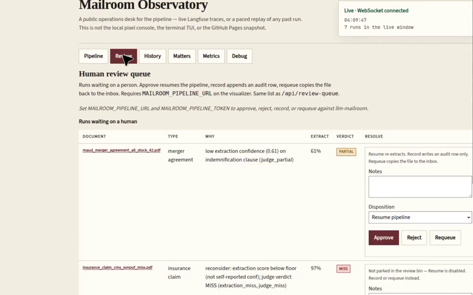](docs/demos/v030-observatory-review-resolve.mp4)

**Walkthrough video** (~56s, pixel desks then Observatory):
[tui-server-observatory-desk-walkthrough.mp4](docs/demos/tui-server-observatory-desk-walkthrough.mp4)
— click the file on GitHub to play it.

[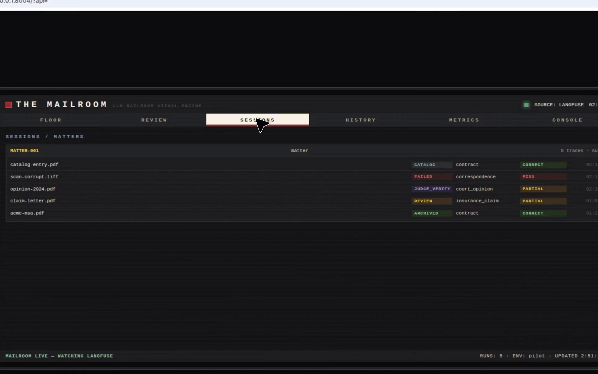](docs/demos/tui-server-observatory-desk-walkthrough.mp4)

**Pilot run — documents moving through the pipeline** (~25s): five envelopes
slide SORTER → EXTRACT → JUDGE → REPORT → ARCHIVE; the merger agreement
peels onto REVIEW; a corporate record fails. Re-record with
`python scripts/demo_pilot_run.py --port 8005`.

[](docs/demos/pilot-run-documents-through-pipeline.mp4)

Open a section below to expand the stills.

<details open>
<summary>Pixel-art console (<code>mailroom-web</code>)</summary>

| | |
|---|---|
| 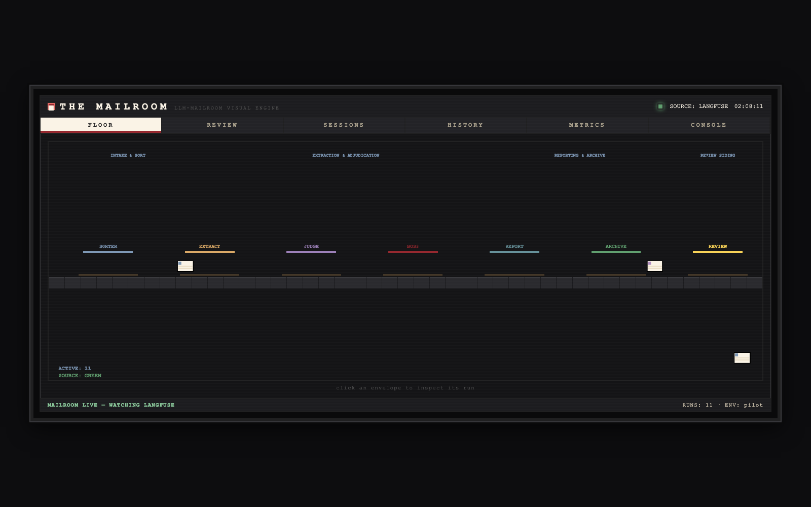 |
| **FLOOR** — seven stations, per-doc-type envelope tints, review siding and failed bin. Click an envelope to inspect. |
|  |
| **PILOT RUN** — live envelopes mid-flight (ACTIVE: 4). Full motion: [pilot-run-documents-through-pipeline.mp4](docs/demos/pilot-run-documents-through-pipeline.mp4). |
|  |
| **INSPECTOR** — node spans, LLM generations, classification / extraction / judge scores. |
| 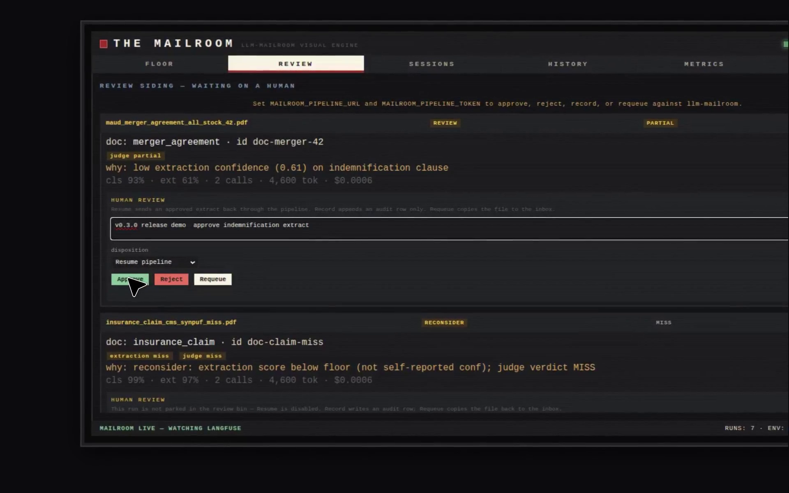 |
| **REVIEW** — parked + RECONSIDER cards with Approve / Reject / Requeue / Complete (disposition resume/record/requeue/complete). |
|  |
| **SESSIONS** — Langfuse matters with their traces, stages, and verdicts. |
| 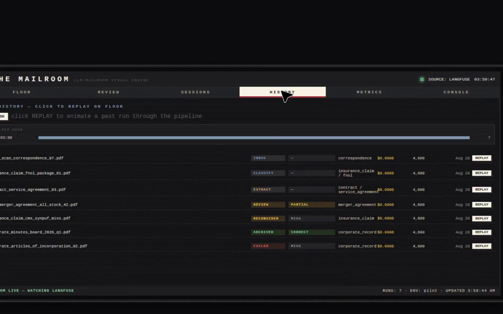 |
| **HISTORY** — recent runs, per-hour volume, REPLAY onto the floor. |
| 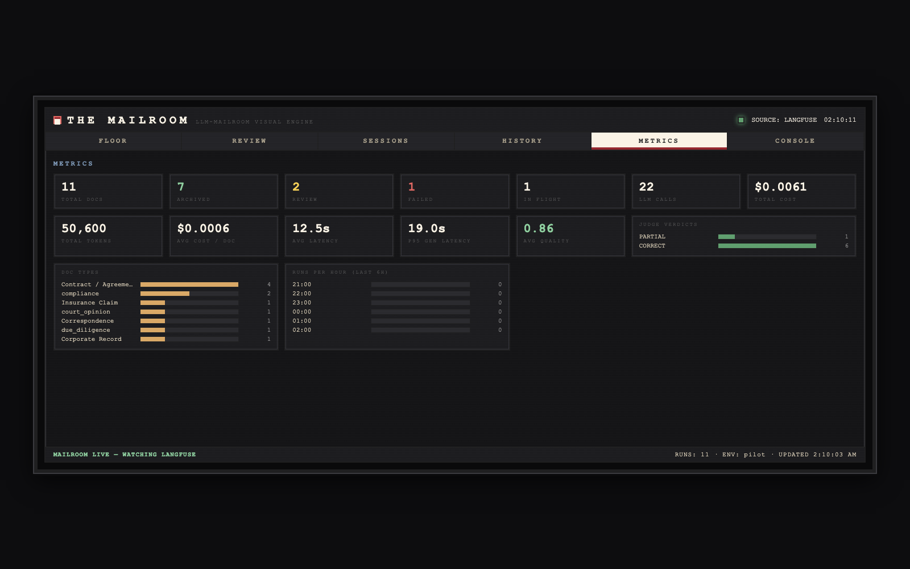 |
| **METRICS** — docs processed, archived/review/failed split, cost, tokens, judge-verdict mix, per-doc-type counts. |
|  |
| **CONSOLE** — AgentLab-style live log plus the DEBUG capture toggle. |

</details>

<details open>
<summary>Hosted Observatory (<code>/live</code>, <code>mailroom-hosted</code>)</summary>

| | |
|---|---|
| 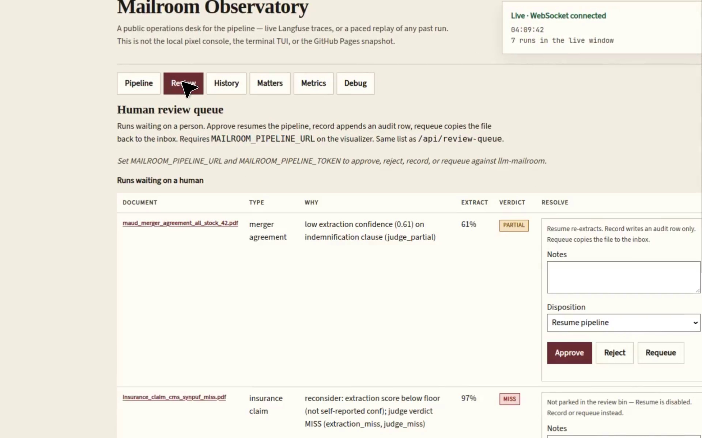 |
| **Pipeline** — live trays including INBOX hopper, Sorter · Extract · Judge · Boss · Report · Archive · Review · Completed. |
| 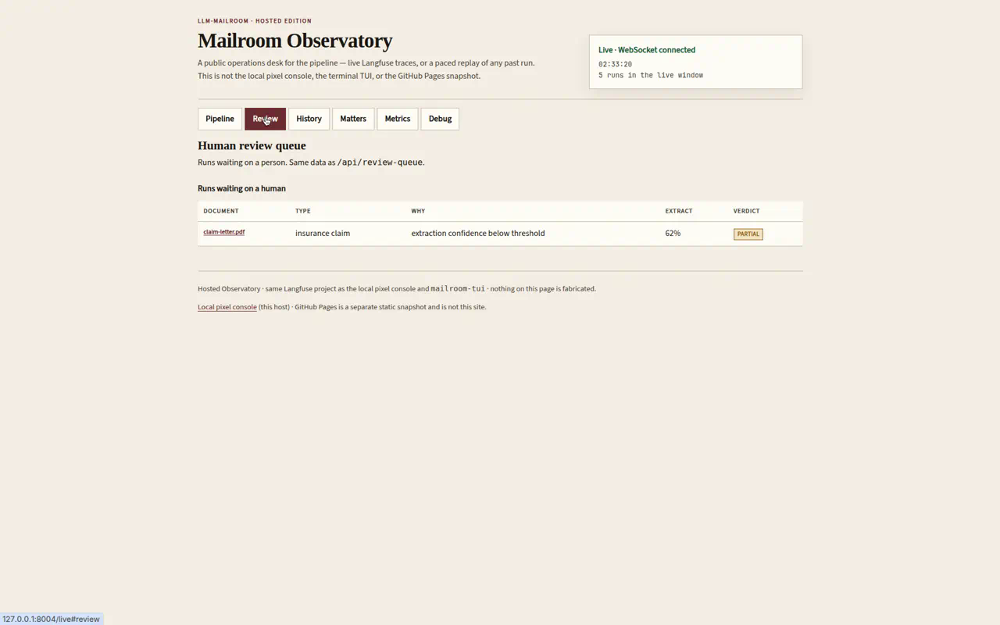 |
| **Review** — human-review queue with inline resolve (Approve / Reject / Requeue / Complete). |
| 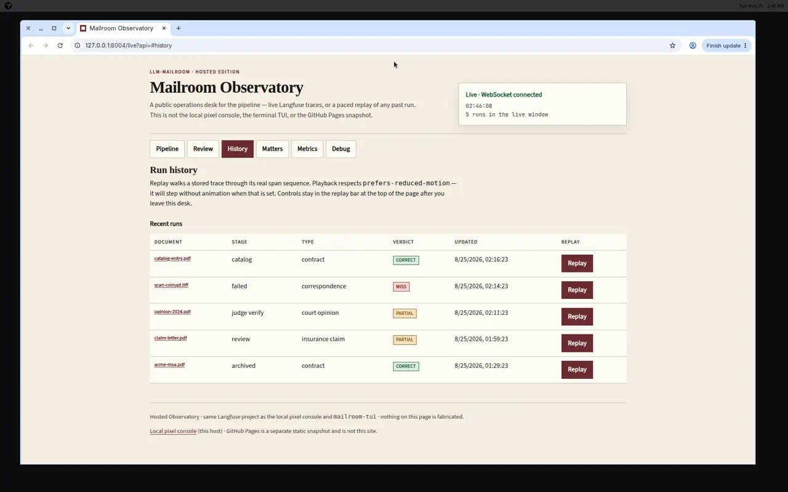 |
| **History** — recent runs with paced Replay of stored span sequences. |
|  |
| **Matters** — Langfuse sessions grouped as matters. |
|  |
| **Metrics** — the same window aggregates as the pixel desk. |
|  |
| **Debug** — client ring, `GET /api/debug/bundle`, `POST /api/debug/client`. |

</details>

<details open>
<summary>TUI (<code>mailroom-tui</code>)</summary>

| | |
|---|---|
| 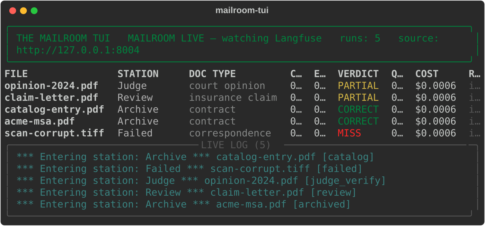 |
| **Floor** (`mailroom-tui --once`) — per-doc table, verdicts, station banners, live log. |
| 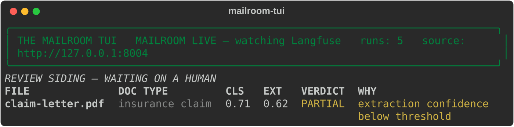 |
| **Review** (`--view review`) — waiting-on-a-human queue with escalation reasons. |
|  |
| **Sessions** (`--view sessions`) — Langfuse matters. |
|  |
| **Metrics** (`--view metrics`) — the same aggregates as `/api/metrics`. |

Keys: `[f]loor` `[r]eview` `[s]essions` `[m]etrics` `[i]nspect` `[` `]` `[d]ebug` `[q]uit`.

</details>

---

<details>
<summary>Demo data (play-testing without a live run)</summary>

Demo runs are seeded **into** Langfuse (env `demo`) — the visualizer still
reads Langfuse only, so nothing on screen is ever canned data:

```bash
python scripts/seed_demo.py                       # seed 13 demo runs (incl.
                                                  # judge-gate + arbiter paths)
python scripts/seed_demo.py --list-scenarios      # what the demo set covers
python scripts/seed_demo.py --check --check-api   # verify seeded runs against
                                                  # stored Langfuse logs AND the
                                                  # running server's display API
python scripts/seed_demo.py --check-logs <dir>    # verify against run logs saved
                                                  # by llm-mailroom's
                                                  # scripts/sync_langfuse_logs.py
```

The pixel `D` key does **not** fabricate envelopes on a live floor. Demo
envelopes are opt-in (`?demo=1`) and only when the trace source is down.

</details>

<details>
<summary>Requirements</summary>

- Python 3.11+
- A Langfuse project (the `llm-mailroom` project on US cloud by default)
  with project-scoped API keys in `.env`
- Optional `[pipeline]` extra to pin dist `mailroom` @ `2c0bcac` and import
  `pipeline.review_resolve`. A sibling `../llm-mailroom` checkout is only
  needed for `MAILROOM_TAXONOMY`, production-pilot scripts, or the producer
  checkout/git-archive fallback (`MAILROOM_PIPELINE_ROOT`).
- `arize-phoenix-client` (optional — only for the Phoenix trace source)

</details>

<details>
<summary>Hosted Observatory (public URL — not GitHub Pages)</summary>

The Observatory is a **separate live site** meant to be deployed to a real
host (Hugging Face Spaces, Fly, Render, Cloud Run, a VPS). It is not the
Pages snapshot and not the pixel-art console.

```bash
mailroom-hosted                          # 0.0.0.0:8001  →  / and /live
docker build -t mailroom-observatory .
docker run --rm -p 7860:7860 --env-file .env mailroom-observatory
```

Full deploy notes (Spaces secrets, keyboard map, how it differs from the
other surfaces): [`hosted/README.md`](hosted/README.md).

</details>

<details>
<summary>GitHub Pages edition (static site + local Phoenix)</summary>

The Mailroom also runs as a **static site on GitHub Pages** with three data
modes:

```bash
# one-time: Settings → Pages → Source: "Deploy from a branch" → gh-pages /docs
scripts/publish_pages.sh                          # build site/ + push gh-pages docs/
scripts/publish_pages.sh --source both            # Langfuse + Phoenix snapshot
scripts/publish_pages.sh --dry-run                # build + verify, don't push
scripts/publish_pages.sh --status                 # is the live site in sync with HEAD?
```

**Keeping main and gh-pages in sync** (no Actions): enable the committed
pre-push hook once per clone — `git config core.hooksPath hooks` — and every
push of `main` republishes `gh-pages:/docs` automatically. A failed
republish (e.g. a Langfuse hiccup) warns without blocking the code push;
set `MAILROOM_STRICT_SYNC=1` to make failures block instead.
`scripts/publish_pages.sh --status` reports drift any time (exit 1 = stale).
The publisher must run from `main` — it refuses cleanly if another branch
(e.g. `gh-pages` in GitHub Desktop) is checked out.

The publisher needs no GitHub Actions (deliberately — it uses Pages' native
deploy-from-branch mode): it stages `web/` with relative asset paths, exports
a JSON snapshot of the configured trace source, verifies it, and pushes the
site into `docs/` on the `gh-pages` branch (anything else on that branch's
root is left untouched). Re-run any time to refresh the snapshot.

1. **Snapshot mode** — a build-time JSON export of the configured trace
   source is bundled into the site (`data/*.json`). Works with zero backend,
   zero secrets in the browser; the lamp shows `SOURCE: SNAPSHOT`. Published
   locally by `scripts/publish_pages.sh` (no GitHub Actions required) from
   Langfuse repo secrets or a local Phoenix — without a reachable source the
   site ships empty and shows its honest CLOSED state.
2. **Live mode** — point the static page at any reachable Mailroom API:
   append `?api=http://localhost:8001` once (persisted to `localStorage`).
   `?api=` (empty) **clears** a stale persisted base. Run the server locally
   with CORS enabled (`MAILROOM_CORS_ORIGINS`) and the Pages UI goes fully
   live, WS included. Note: Chrome/Firefox allow HTTPS→`http://localhost`
   calls; Safari may block them.
3. **Phoenix mode** — traces from a *locally running* Arize Phoenix
   (default `http://localhost:6006`) can drive the console:

   ```bash
   pip install arize-phoenix-client
   # start Phoenix (e.g. `phoenix serve`) and point your pipeline's OTLP
   # exporter at it, then:
   MAILROOM_SOURCE=phoenix mailroom-web     # or MAILROOM_SOURCE=both for Langfuse + Phoenix
   ```

   Phoenix spans are mapped into the llm-mailroom display contract:
   verb-first span names route through the stage map, LLM spans become
   generations (model/tokens/cost), annotations become scores. Unmapped
   spans degrade to unknown staging — same visible-by-design breakage map.

</details>

<details>
<summary>Debug console for agents</summary>

Every fetch, WS frame, error, and console line lands in a client-side ring
buffer at `window.__MAILROOM_DEBUG__` (`dump()`, clipboard copy,
`pullServer()`, `pushClient()`, `export()` → `mailroom-debug.json`);
`?debug=1` or the CONSOLE tab's DEBUG toggle enables verbose capture.

The hosted Observatory has a parallel suite: `window.__OBSERVATORY_DEBUG__`,
Debug desk `#debug` (`?debug=1`). The TUI records urllib/WS failures in
`LAST_ERRORS` (`[d]ebug`, `--view debug`) and can pull the same bundle.

Server side:

- `GET /api/debug/bundle` — one-pull: health + source + server ring + last
  client dumps
- `POST /api/debug/client` — store a browser dump for the next agent pull
- `GET /api/debug/logs?limit=` — always-on request ring buffer
- `GET /api/debug/source` — configured sources / knobs (`mailroom.pin`)
- `GET /api/meta` — machine-readable endpoint index plus active sources,
  version, and the llm-mailroom pin
- `MAILROOM_DEBUG=1` — verbose stdout logging

Snapshot builds add `debug/build-info.json` (git SHA, counts, generation time).

</details>

<details>
<summary>Configuration reference</summary>

All knobs live in `.env` (see `.env.example`): Langfuse keys/host
(`LANGFUSE_HOST`, default `https://us.cloud.langfuse.com`), poll cadence
(`MAILROOM_POLL_INTERVAL`), recent window (default **7 days**,
`MAILROOM_RECENT_WINDOW=604800`), trace limit (`MAILROOM_TRACE_LIMIT=200`),
optional tag/env filters, `MAILROOM_PORT` (default `8001`),
`MAILROOM_TAXONOMY`, and `MAILROOM_PIPELINE_URL` + `MAILROOM_PIPELINE_TOKEN`
(producer on `:8000` — watcher/inbox liveness, human-review resolve, class
correction mapped to `override_doc_type`, parked-file source via `/v1`).
`MAILROOM_PIPELINE_API_PREFIX` defaults to `/v1`. `MAILROOM_API_URL` is the TUI → this
visualizer (`:8001`), not the producer. Optional `MAILROOM_PIPELINE_ROOT`
points at an llm-mailroom checkout. The GH Pages edition adds `MAILROOM_SOURCE`
(`langfuse|phoenix|both`), `PHOENIX_ENDPOINT` / `PHOENIX_API_KEY` /
`MAILROOM_PHOENIX_PROJECT`, `MAILROOM_CORS_ORIGINS`, and `MAILROOM_DEBUG`.

> [!IMPORTANT]
> `pipeline_schema.py` is cached at process level — editing `taxonomy.yaml`
> (or pointing `MAILROOM_TAXONOMY` at the pipeline's copy) requires a server
> restart to take effect.

</details>

<details>
<summary>The trace contract &amp; the mirror duty</summary>

The-Mailroom does not own the trace contract it renders — it **mirrors** it
from the upstream pipeline. This is the repo's #1 maintenance duty: when
`llm-mailroom` changes span names, observation types (`NODE_OBSERVATION_TYPES`:
chain / agent / evaluator / retriever / generation / span), node order, the
agent roster, live doc classes (5 extract classes + `merger_agreement` alias +
`unknown` routing token), Hub subclasses, confidence thresholds, or
judge score names (`mailroom-pipeline-judge`, `mailroom-pipeline-quality`),
this repo must update `mailroom_ui/pipeline_schema.py` and
`mailroom_ui/trace_interpreter.py` in the same change window.

Until mirrored, breakage is visible by design: new spans render as an
`unknown` stage, new observation types can hide a node or mis-file a
generation, new doc classes fall back to the gray default stamp color,
renamed judge scores vanish from runs. The full contract — span inventory,
observation types, score names, metadata/tags, and the complete breakage map
— lives in [`AGENTS.md`](AGENTS.md) ("Sister repo" section), which is
authoritative for pipeline internals alongside the pipeline's own `AGENTS.md`.

</details>

<details>
<summary>Project layout</summary>

```
mailroom_ui/   display core (Langfuse + Phoenix adapters, interpreter,
               topology mirror) + operator path (producer.py pin adapter,
               review_actions.py / pipeline_ops.py)
server/        FastAPI: Langfuse reads + producer REVIEW proxy + /ws;
               serves web/ (pixel) and hosted/ (/live)
web/           pixel-art SPA (vanilla HTML/CSS/JS, no build step)
hosted/        Observatory — public modern accessible desk
tui/           rich console — mailroom-tui (shipped)
scripts/       seed_demo (demo runs INTO Langfuse) · demo_review_tray
               (working /v1 REVIEW) · demo_pilot_run · demo_v030_cast
               (honest-503 v0.3.0 desks) · run_production_pilot
               · eval_pipeline · export_snapshot · publish_pages
               · release · render_tui_shots
docs/ + wiki/  mirrored documentation (wiki/sync-wiki.sh publishes the wiki)
docs/screenshots/  stills of every pixel / Observatory / TUI desk
docs/demos/        walkthrough mp4 + pilot-run mp4 + The-Mailroom-Demos.ipynb
tests/         pytest vs fake Langfuse + tests/fake_producer.py — never live APIs
```

</details>

<details>
<summary>Docs map</summary>

| Doc | What it is |
|---|---|
| [`docs/index.md`](docs/index.md) | Docs landing (mirrors wiki Home) |
| [`docs/architecture.md`](docs/architecture.md) | How traces become pixels; producer proxy |
| [`docs/demos.md`](docs/demos.md) | Stills, mp4s, working REVIEW tray vs v0.3.0 503 cast |
| [`docs/releases.md`](docs/releases.md) | Semver, tagging, current v0.3.0 |
| [`hosted/README.md`](hosted/README.md) | Observatory deploy (Spaces / Docker) |
| [`AGENTS.md`](AGENTS.md) | Process + architecture authority for agents |
| [`.cursor/skills/README.md`](.cursor/skills/README.md) | Skill router |
| [`CHANGELOG.md`](CHANGELOG.md) | Keep-a-Changelog record |

Wiki copies: [`wiki/Home.md`](wiki/Home.md), [`wiki/Architecture.md`](wiki/Architecture.md),
[`wiki/Demos.md`](wiki/Demos.md), [`wiki/Releases.md`](wiki/Releases.md).
Edit `docs/` and `wiki/` together.

</details>

<details>
<summary>Tests</summary>

```bash
python -m pytest tests/ -q
```

Tests never hit real Langfuse — `tests/fake_langfuse.py` provides v2/v3
snake_case and v4 camelCase fixtures mirroring the trace contract.
`tests/fake_producer.py` stubs llm-mailroom `/v1` for REVIEW. The suite
covers the TUI, every `/api/meta` endpoint, SPA source contracts, and the
demos gallery (no JS test harness).

</details>

<details>
<summary>Releases</summary>

Semantic versioning with a Keep-a-Changelog `CHANGELOG.md`, README/wiki
updates on major changes, and annotated `vX.Y.Z` tags matching the changelog.
Current tagged release is **v0.3.0**. Post-tag work (working REVIEW tray,
`[pipeline]` pin) sits under `[Unreleased]`.
`python scripts/release.py --help` drives the mechanical steps. See
`AGENTS.md` → "Release process" for the full procedure.

</details>

---

## License & credits

Visual palette and character direction derived from the AgentLaboratory
project's artwork. Built for the `llm-mailroom` pipeline — see that repo and
its [sister-repos map](https://github.com/Exios66/llm-mailroom/blob/main/docs/sister-repos.md)
for the full governed constellation. No license published yet.
